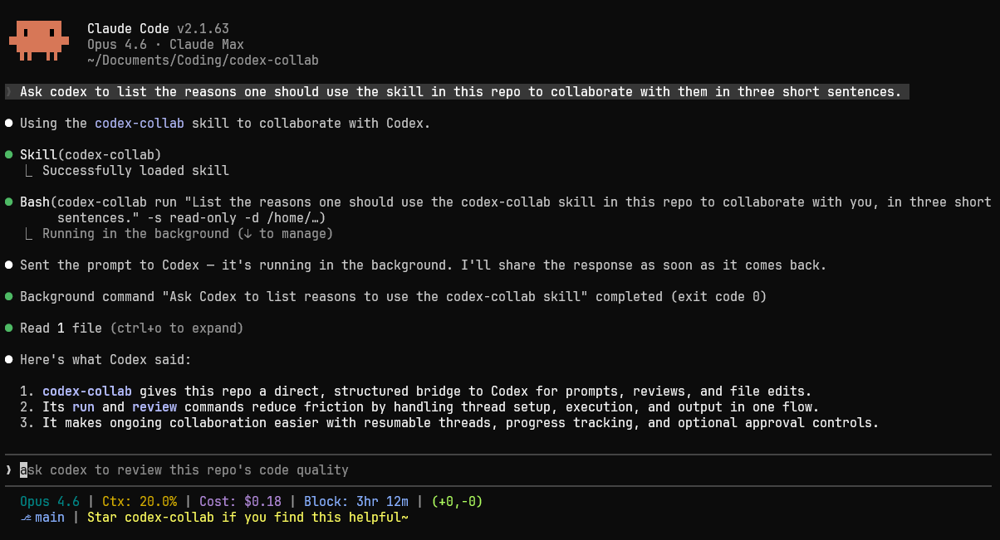

# codex-collab

[](https://github.com/Kevin7Qi/codex-collab/actions/workflows/ci.yml)
[](LICENSE)
[](https://bun.sh/)
[](https://www.typescriptlang.org/)

[English](README.md) | [中文](README.zh-CN.md)

Collaborate with [Codex](https://github.com/openai/codex) from [Claude Code](https://docs.anthropic.com/en/docs/claude-code). Run tasks, get code reviews, do parallel research, all without leaving your Claude session.



codex-collab is a [Claude Code skill](https://docs.anthropic.com/en/docs/claude-code/skills) that drives Codex through its app server JSON-RPC protocol. It manages threads, streams structured events, handles tool-call approvals, and lets you resume conversations — all without leaving your Claude session.

## Why

- **Structured communication** — Talks to Codex via JSON-RPC over stdio. Every event is typed and parseable.
- **Event-driven progress** — Streams progress lines as Codex works, so Claude sees what's happening in real time.
- **Review automation** — One command to run code reviews for PRs, uncommitted changes, or specific commits in a read-only sandbox.
- **Thread reuse** — Resume existing threads to send follow-up prompts, build on previous responses, or steer the work in a new direction.
- **Approval control** — Configurable approval policies for tool calls: auto-approve, interactive, or deny.

## Installation

Requires [Bun](https://bun.sh/) >= 1.0 and [Codex CLI](https://github.com/openai/codex) (`npm install -g @openai/codex`) on your PATH. Tested on Linux (Ubuntu 22.04), macOS, and Windows 10.

```bash
git clone https://github.com/Kevin7Qi/codex-collab.git
cd codex-collab
```

### Linux / macOS

```bash
./install.sh
```

### Windows

```powershell
powershell -ExecutionPolicy Bypass -File install.ps1
```

After installation, **reopen your terminal** so the updated PATH takes effect, then run `codex-collab health` to verify.

The installer builds a self-contained bundle, deploys it to your home directory (`~/.claude/skills/codex-collab/` on Linux/macOS, `%USERPROFILE%\.claude\skills\codex-collab\` on Windows), and adds a binary shim to your PATH. Once installed, Claude discovers the skill automatically.

<details>
<summary>Development mode</summary>

Use `--dev` to symlink source files for live-reloading instead of building a bundle:

```bash
# Linux / macOS
./install.sh --dev

# Windows (may require Developer Mode or an elevated terminal for symlinks)
powershell -ExecutionPolicy Bypass -File install.ps1 -Dev
```

</details>

## Quick Start

```bash
# Run a prompted task
codex-collab run "what does this project do?" -s read-only --content-only

# Code review
codex-collab review --content-only

# Resume a thread
codex-collab run --resume <id> "now check error handling" --content-only
```

## CLI Commands

| Command | Description |
|---------|-------------|
| `run "prompt" [opts]` | Start thread, send prompt, wait, print output |
| `review [opts]` | Code review (PR, uncommitted, commit) |
| `jobs [--json] [--all]` | List threads (`--limit <n>` to cap) |
| `kill <id>` | Interrupt running thread |
| `output <id>` | Full log for thread |
| `progress <id>` | Recent activity (tail of log) |
| `models` | List available models |
| `health` | Check dependencies |

<details>
<summary>Thread management</summary>

| Command | Description |
|---------|-------------|
| `delete <id>` | Archive thread, delete local files |
| `clean` | Delete old logs and stale mappings |
| `approve <id>` | Approve a pending request |
| `decline <id>` | Decline a pending request |

</details>

<details>
<summary>Options</summary>

| Flag | Description |
|------|-------------|
| `-d, --dir <path>` | Working directory |
| `-m, --model <model>` | Model name |
| `-r, --reasoning <level>` | low, medium, high, xhigh (default: xhigh) |
| `-s, --sandbox <mode>` | read-only, workspace-write, danger-full-access (default: workspace-write; review always uses read-only) |
| `--mode <mode>` | Review mode: pr, uncommitted, commit, custom |
| `--ref <hash>` | Commit ref for `--mode commit` |
| `--resume <id>` | Resume existing thread |
| `--approval <policy>` | Approval policy: never, on-request, on-failure, untrusted (default: never) |
| `--content-only` | Suppress progress lines; with `output`, return only extracted content |
| `--timeout <sec>` | Turn timeout (default: 1200) |
| `--base <branch>` | Base branch for PR review (default: main) |

</details>

## Contributing

See [CONTRIBUTING.md](CONTRIBUTING.md) for development setup and guidelines. This project follows the [Contributor Covenant](CODE_OF_CONDUCT.md) code of conduct.

## See also

For simpler interactions, you can also check out the official [Codex MCP server](https://developers.openai.com/codex/guides/agents-sdk). codex-collab is designed as a Claude Code skill, with built-in support for code review, thread management, and real-time progress streaming.
