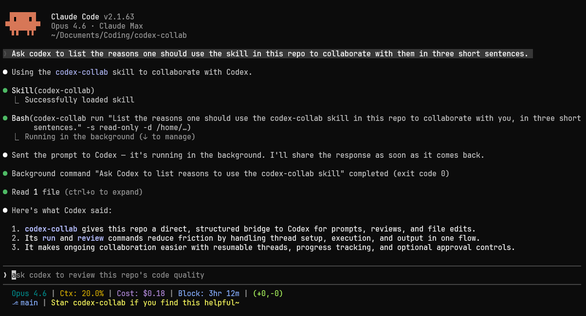

# codex-collab

[](https://github.com/Kevin7Qi/codex-collab/actions/workflows/ci.yml)
[](LICENSE)
[](https://bun.sh/)
[](https://www.typescriptlang.org/)

[English](README.md) | [中文](README.zh-CN.md)

Collaborate with [Codex](https://github.com/openai/codex) from [Claude Code](https://docs.anthropic.com/en/docs/claude-code). Run tasks, get code reviews, do parallel research, all without leaving your Claude session.



codex-collab is a [Claude Code skill](https://docs.anthropic.com/en/docs/claude-code/skills) that drives Codex through its app server JSON-RPC protocol. It manages threads, streams structured events, handles tool-call approvals, and lets you resume conversations — all without leaving your Claude session.

## Why

- **Structured communication** — Talks to Codex via JSON-RPC over stdio. Every event is typed and parseable.
- **Event-driven progress** — Streams progress lines as Codex works, so Claude sees what's happening in real time.
- **Review automation** — One command to run code reviews for PRs, uncommitted changes, or specific commits in a read-only sandbox.
- **Thread reuse** — Resume existing threads to send follow-up prompts, build on previous responses, or steer the work in a new direction.
- **Approval control** — Configurable approval policies for tool calls: auto-approve, interactive, deny, or Codex's Guardian auto-reviewer (`--approval auto`).
- **Two-way ask channel** — Codex can ask a question mid-turn (`ask`) and keep working once the answer arrives (`answer`); `next` blocks until something needs attention. Fail-open: an unanswered question never stalls a run.
- **Live observability** — `run --detach` hands a long task to a detached runner; `follow --watch` is a purpose-built live view that tracks every run in a terminal pane.
- **Memory isolation** — Threads created by codex-collab are excluded from Codex's memory feature by default, so agent-driven sessions don't shape Codex's learned picture of how *you* work. Opt back in with `--memory` (see Options for details).

## Installation

Requires [Bun](https://bun.sh/) >= 1.0 and [Codex CLI](https://github.com/openai/codex) (`npm install -g @openai/codex`) on your PATH. Tested on Linux (Ubuntu 22.04), macOS, and Windows 10.

```bash
git clone https://github.com/Kevin7Qi/codex-collab.git
cd codex-collab
```

### Linux / macOS

```bash
./install.sh
```

### Windows

```powershell
powershell -ExecutionPolicy Bypass -File install.ps1
```

After installation, **reopen your terminal** so the updated PATH takes effect, then run `codex-collab health` to verify.

The installer builds a self-contained bundle, deploys it to your home directory (`~/.claude/skills/codex-collab/` on Linux/macOS, `%USERPROFILE%\.claude\skills\codex-collab\` on Windows), and installs a binary shim (`install.ps1` adds it to your PATH; `install.sh` places it in `~/.local/bin` and prints instructions if that directory is not already on your PATH). Once installed, Claude discovers the skill automatically.

### Upgrading

To upgrade an existing install, pull the latest version and rerun the installer:

```bash
git pull
./install.sh
codex-collab health
```

On Windows:

```powershell
git pull
powershell -ExecutionPolicy Bypass -File install.ps1
codex-collab health
```

The installer replaces the installed skill bundle and binary shim. Existing configuration, templates, thread history, and run logs under `~/.codex-collab/` are preserved. Treat `~/.claude/skills/codex-collab/` as installer-managed: manual edits there may be overwritten on upgrade.

When upgrading from older versions, codex-collab automatically migrates thread state to the per-workspace layout on first use. No manual state migration is required. The old `jobs` command remains available as a deprecated alias for `threads`.

<details>
<summary>Development mode</summary>

Use `--dev` to symlink source files for live-reloading instead of building a bundle:

```bash
# Linux / macOS
./install.sh --dev

# Windows (may require Developer Mode or an elevated terminal for symlinks)
powershell -ExecutionPolicy Bypass -File install.ps1 -Dev
```

</details>

## Quick Start

```bash
# Run a prompted task
codex-collab run "what does this project do?" -s read-only --content-only

# Code review
codex-collab review --content-only

# Resume a thread
codex-collab run --resume <id> "now check error handling" --content-only

# Long task: detach it, watch it live in another pane
codex-collab run "large refactor" --detach --approval auto
codex-collab follow --watch
```

## CLI Commands

| Command | Description |
|---------|-------------|
| `run "prompt" [opts]` | Start thread, send prompt, wait, print output (`run -` reads the prompt from stdin — no shell-quoting hazards) |
| `review [opts]` | Code review (PR, uncommitted, commit) |
| `threads [--json] [--all]` | List threads (`--limit <n>` to cap, `--discover` to scan server, `--session` for only threads the current session has run) |
| `kill <id> [--clear]` | Interrupt running thread. An active goal is paused first — interrupt alone would just respawn a continuation turn; `--clear` abandons the goal instead |
| `follow [id]` | Live view of a running thread; exits with its status (replays the last run when already finished). Without an ID, attaches to the workspace's active run — or replays the most recent one. With `--watch`, stays open and follows each new run (every run shown once, in start order) |
| `output <id> [--last]` | Full log for thread (`--last`: only the latest turn's output) |
| `progress <id>` | Recent activity (tail of log) |
| `peek <id>` | Show recent conversation slice from server |
| `ask "question"` | (for Codex, mid-turn) Post a question to the collaborator and wait for the answer; `--timeout <sec>` sets the deadline (default 600). Fails open: on expiry it prints proceed-on-your-judgment guidance and exits 0 |
| `answer <id> "text"` | Answer a pending question (`answer <id> -` reads the answer from stdin) |
| `questions [id]` | List pending questions in this workspace; with an ID, show that question's full text |
| `next` | Block until something needs attention (question or approval), print it in full with how to respond, exit |
| `config [key] [value]` | Show or set persistent defaults |
| `models` | List available models |
| `templates` | List available prompt templates |
| `health` | Check dependencies |
| `version` | Print version (also `-v`/`--version` before a command) |

<details>
<summary>Thread management</summary>

| Command | Description |
|---------|-------------|
| `delete <id> [--purge]` | Archive thread (recoverable via `codex unarchive`) and delete local files; `--purge` permanently deletes it server-side instead |
| `clean` | Delete old logs and stale mappings |
| `approve <id>` | Approve a pending request |
| `decline <id>` | Decline a pending request |

</details>

<details>
<summary>Options</summary>

| Flag | Description |
|------|-------------|
| `-d, --dir <path>` | Working directory |
| `-m, --model <model>` | Model name (default: auto — latest available) |
| `-r, --reasoning <level>` | none, minimal, low, medium, high, xhigh (default: auto — highest for model) |
| `-s, --sandbox <mode>` | read-only, workspace-write, danger-full-access (default: workspace-write; review always uses read-only) |
| `--mode <mode>` | Review mode: pr, uncommitted, commit, custom |
| `--ref <hash>` | Commit ref for `--mode commit` |
| `--resume <id>` | Resume existing thread |
| `--approval <policy>` | Approval policy: never, on-request, on-failure, untrusted, auto (default: never). `auto`: Codex's Guardian reviewer approves or denies each request autonomously — never blocks on a human; decisions stream as Guardian lines |
| `--memory` | Let Codex's memory feature learn from threads this run creates. Default: created threads get `thread/memoryMode/set mode=disabled`; resumed threads are never touched (the flag is persistent per-thread, and a thread you created yourself should keep feeding your memory). Governs Codex's *local* memory consolidation (`~/.codex/memories`) only — the `personality` feature is explicit user config (not learned) and unaffected. Persistent form: `config memory true` |
| `--detach` | (run) Return once the turn is running; watch with `follow <id>`. Turn lifetime is decoupled from the invoking shell |
| `-w, --watch` | (follow) Don't exit when the run finishes — keep following each new run (Ctrl-C to stop) |
| `--template <name>` | Prompt template for run command (user `~/.codex-collab/templates/` or built-in) |
| `--goal <objective>` | (run) Create the thread's goal before the first turn (replaces the objective on `--resume`); requires `goals = true` in `~/.codex/config.toml`. With `--template collab` the objective also gets a one-line ask-channel note — re-injected into every continuation turn, so channel awareness survives long goals |
| `--budget <tokens>` | (run) Token budget for `--goal`. Size generously — usage counts each turn's full context, so a single small turn can consume ~60k |
| `--json` | JSON output for supported commands (`threads`, `peek`) |
| `--all` | List all threads with no display limit |
| `--discover` | Query Codex server for threads not in the local index |
| `--limit <n>` | Limit items shown by `threads` or `peek` |
| `--full` | Include all item types in `peek` output (default shows messages only) |
| `--content-only` | Suppress progress lines; with `output`, return only extracted content |
| `--last` | (output) Only the latest turn's output instead of the whole thread history (implies `--content-only`) |
| `--session` | (threads) Only threads the current session has run |
| `--timeout <sec>` | Turn timeout (default: 1200, max 2147483). When a goal is active it scopes the whole goal, and expiry pauses the goal before exiting. For `ask`: answer deadline (default: 600); for `next`: wait deadline (default: wait indefinitely) |
| `--base <branch>` | Base branch for PR review (default: auto-detected default branch) |
| `--` | End of options; remaining arguments are treated as prompt text |
| `-` | (run) Read the prompt from stdin |

`run` and `review` exit with a status code that classifies the outcome: `0` completed, `1` failed, `3` timed out, `4` interrupted, `5` died blocked on an approval (the request is void — resume with a longer `--timeout` or `--approval auto`), `6` broker busy (transient — retry), `7` goal ended blocked or usage/budget-limited — Codex needs steering (resume the thread, or `kill --clear` to abandon the goal).

**Goal mode**: Codex's Goal mode (`goals = true` in `~/.codex/config.toml`) makes threads self-continue — the server starts a new turn the moment one completes while the goal is active. Codex can create a goal mid-turn, or set one explicitly with `run --goal "objective" [--budget <tokens>]` — a natural fit for open-ended objectives that take an unknown number of turns. The objective is re-injected into every continuation turn — one too big to state in a sentence can point at a spec or plan file in the repo instead. When a goal is (or becomes) active on the thread, a `run` follows every continuation turn in the same run record and log until the goal is terminal: the run corresponds to the unit of work, not just its first turn. `--timeout` then bounds the whole goal, and on expiry the goal is **paused** (resumable, no headless token burn) before the CLI exits `3`. `threads` shows each thread's latest goal state (`[goal active: 45k/100k tokens]`).

`next` exits `0` when an event was delivered (printed in full on stdout), `3` when `--timeout` elapsed with no event, and `10` when the workspace is idle — nothing running, nothing pending.

</details>

## Defaults & Configuration

By default, codex-collab auto-selects the **latest model** (preferring `-codex` variants) and the **highest reasoning effort** supported by that model. No configuration needed — it stays current as new models are released.

To override defaults persistently, use `codex-collab config`:

```bash
# Show current config
codex-collab config

# Set a preferred model
codex-collab config model gpt-5.3-codex

# Set default reasoning effort
codex-collab config reasoning high

# Unset a key (return to auto-detection)
codex-collab config model --unset

# Unset all keys
codex-collab config --unset
```

Available keys: `model`, `reasoning`, `sandbox`, `approval`, `timeout`, `memory`

CLI flags always take precedence over config, and config takes precedence over auto-detection:

```
CLI flag  >  config file  >  auto-detected
```

Config is stored in `~/.codex-collab/config.json`.

## Contributing

See [CONTRIBUTING.md](CONTRIBUTING.md) for development setup and guidelines. This project follows the [Contributor Covenant](CODE_OF_CONDUCT.md) code of conduct.

## See also

For simpler interactions, you can also check out the official [Codex MCP server](https://developers.openai.com/codex/guides/agents-sdk). codex-collab is designed as a Claude Code skill, with built-in support for code review, thread management, and real-time progress streaming.
