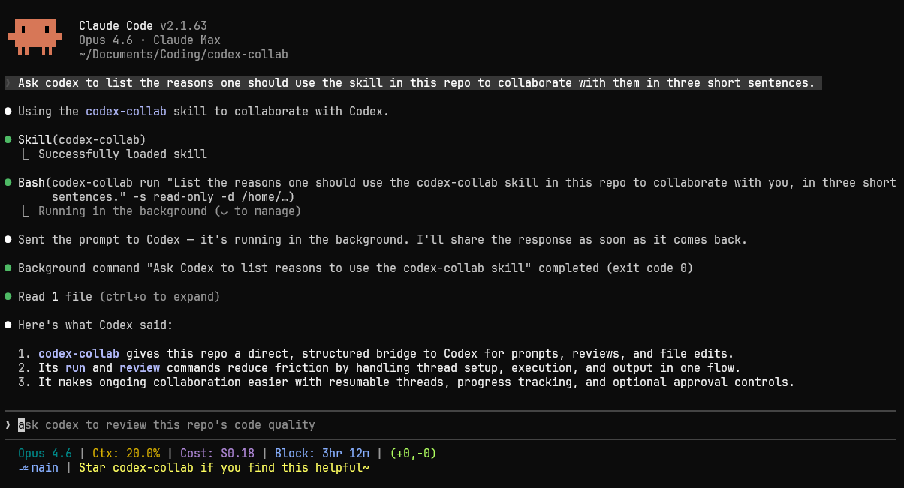

# codex-collab

[](https://github.com/Kevin7Qi/codex-collab/actions/workflows/ci.yml)
[](LICENSE)
[](https://bun.sh/)
[](https://www.typescriptlang.org/)

[English](README.md) | [中文](README.zh-CN.md)

Collaborate with [Codex](https://github.com/openai/codex) from [Claude Code](https://docs.anthropic.com/en/docs/claude-code). Run tasks, get code reviews, do parallel research, all without leaving your Claude session.



codex-collab is a [Claude Code skill](https://docs.anthropic.com/en/docs/claude-code/skills) that drives Codex through its app server JSON-RPC protocol. It manages threads, streams structured events, handles tool-call approvals, and lets you resume conversations.

## Why

- **Native peer messaging** — The workspace broker registers Codex as a peer in Claude Code's cross-session messaging, so Claude sessions message Codex directly (`SendMessage`) and Codex answers back — including asking Claude questions mid-task via a `collab.consult` tool. No CLI in the hot path.
- **Structured communication** — Talks to Codex via JSON-RPC over stdio. Every event is typed and parseable.
- **Event-driven progress** — Streams progress lines as Codex works, so Claude sees what's happening in real time.
- **Review automation** — One command to run code reviews for PRs, uncommitted changes, or specific commits in a read-only sandbox.
- **Thread reuse** — Resume existing threads to send follow-up prompts, build on previous responses, or steer the work in a new direction.
- **Approval control** — Configurable approval policies for tool calls: auto-approve, interactive, deny, or Codex's Guardian auto-reviewer (`--approval auto`).
- **Two-way ask channel** — Codex can ask a question mid-turn (`ask`) and keep working once the answer arrives (`answer`); `next` blocks until something needs attention. Fail-open: an unanswered question never stalls a run.
- **Live observability** — `run --detach` hands a long task to a detached runner; `follow --watch` is a purpose-built live view that tracks every run in a terminal pane.
- **Memory isolation** — Threads created by codex-collab are excluded from Codex's memory feature by default, so agent-driven sessions don't shape Codex's learned picture of how *you* work. Opt back in with `--memory` (see Options for details).

## Installation

Requires [Bun](https://bun.sh/) >= 1.0 and [Codex CLI](https://github.com/openai/codex) (`npm install -g @openai/codex`) on your PATH. Tested on Linux (Ubuntu 22.04), macOS, and Windows 10.

```bash
git clone https://github.com/Kevin7Qi/codex-collab.git
cd codex-collab
```

### Linux / macOS

```bash
./install.sh
```

### Windows

```powershell
powershell -ExecutionPolicy Bypass -File install.ps1
```

After installation, run `codex-collab health` to verify. If the command is not found, `~/.local/bin` is not on your PATH yet: reopen your terminal, add the export line the installer prints, or use the full path `~/.local/bin/codex-collab health`.

> [!TIP]
> You can hand the install to an agent. Running it outside Claude Code, for example from Codex, means the skill is ready the next time you start Claude. It will ask permission to write outside the repository.

<details>
<summary>Where things get installed</summary>

The installer builds a self-contained bundle plus a binary shim. On Linux and macOS these go to `~/.claude/skills/codex-collab/` and `~/.local/bin`. On Windows they go to `%USERPROFILE%\.claude\skills\codex-collab\`, and `install.ps1` adds the shim to your PATH.

Claude discovers the skill automatically, including in a session that is already running. The exception is your first skill: if `~/.claude/skills/` did not exist before, restart Claude Code once so the new directory is watched.

</details>

### Upgrading

An installed codex-collab can update itself — no manual `git pull` needed:

```bash
codex-collab update            # show the latest release and changelog, confirm, then install
codex-collab update --check    # report only, install nothing
```

`update` fetches the latest release, rebuilds it locally, and reinstalls. Nothing is installed without your confirmation: an interactive `y/N` prompt, or an explicit `--yes` when there is no terminal to ask. `run`, `review`, and `health` print a one-line notice when a newer release exists, but never install anything themselves.

Upgrading manually still works, and is the only way to update a dev install (`install.sh --dev`):

```bash
git pull
./install.sh    # Windows: powershell -ExecutionPolicy Bypass -File install.ps1
codex-collab health
```

<details>
<summary>More on upgrading</summary>

`update --skip` mutes notices for one release, and `CODEX_COLLAB_NO_UPDATE_CHECK=1` turns the release check off entirely. The local skill-drift check is offline and stays on regardless.

If the installed SKILL.md falls out of step with the binary or your template set, `codex-collab skill sync` shows the pending diff and applies it once you confirm.

Both upgrade paths replace the skill bundle and the binary shim. Everything under `~/.codex-collab/` is preserved: configuration, templates, thread history, and run logs. Treat `~/.claude/skills/codex-collab/` as installer-managed, since manual edits there can be overwritten on upgrade.

</details>

<details>
<summary>Development mode</summary>

Use `--dev` to symlink source files for live-reloading instead of building a bundle:

```bash
# Linux / macOS
./install.sh --dev

# Windows (may require Developer Mode or an elevated terminal for symlinks)
powershell -ExecutionPolicy Bypass -File install.ps1 -Dev
```

</details>

## Quick Start

```bash
# Run a prompted task
codex-collab run "what does this project do?" -s read-only --content-only

# Code review
codex-collab review --content-only

# Resume a thread
codex-collab run --resume <id> "now check error handling" --content-only

# Long task: detach it, watch it live in another pane
codex-collab run "large refactor" --detach --approval auto
codex-collab follow --watch
```

## CLI Commands

| Command | Description |
|---------|-------------|
| `run "prompt" [opts]` | Start a thread, send a prompt, wait, print the output (`run -` reads the prompt from stdin) |
| `review [opts]` | Code review (PR, uncommitted, or a specific commit) |
| `threads [--json] [--all]` | List threads (`--discover` scans the server and marks threads open or active on the app-server, `--session` limits to this session) |
| `follow [id]` | Live view of a running thread in your own terminal pane. Without an ID it attaches to the active run; `--watch` keeps following each new run |
| `output <id> [--last]` | Full log for a thread (`--last`: only the latest turn's output) |
| `kill <id> [--clear]` | Stop a running thread. An active goal is paused first; `--clear` abandons it |
| `peer [up]` | Show the native-messaging peer's status; `peer up` starts the broker (and with it the peer) |

The commands Codex uses to reach Claude (`peers`, `send`, `task`) are under [Peer messaging](#peer-messaging).

<details>
<summary>Questions and approvals</summary>

| Command | Description |
|---------|-------------|
| `ask "question"` | Invoked by Codex mid-turn to ask a question and wait for the answer. `--timeout <sec>` sets the deadline (default 600). Fails open: on expiry it tells Codex to proceed on its own judgment and exits 0 |
| `answer <id> "text"` | Answer a pending question (`answer <id> -` reads from stdin) |
| `questions [id]` | List pending questions in this workspace; with an ID, show the full text |
| `next` | Block until something needs attention, print it in full with how to respond, then exit |
| `approve <id>` | Approve a pending request |
| `decline <id>` | Decline a pending request |

</details>

<details>
<summary>Inspection and configuration</summary>

| Command | Description |
|---------|-------------|
| `progress <id>` | Recent activity (tail of the log) |
| `peek <id>` | Recent conversation slice from the server |
| `config [key] [value]` | Show or set persistent defaults |
| `models` | List available models |
| `templates` | List available prompt templates |

</details>

<details>
<summary>Maintenance</summary>

| Command | Description |
|---------|-------------|
| `delete <id> [--purge]` | Archive a thread (recoverable via `codex unarchive`) and delete local files; `--purge` deletes it server-side instead |
| `clean` | Delete old logs and stale mappings |
| `skill sync [--yes]` | Regenerate the installed SKILL.md when it drifts from the binary or template set. Prints the diff, applies only on confirmation |
| `update` | Check for a newer release and install it with confirmation. See [Upgrading](#upgrading) |
| `health` | Check dependencies and authentication, name the app-server the broker runs on, and report Codex-side skill and exec-policy status |
| `version` | Print version (also `-v`/`--version` before a command) |

</details>

<details>
<summary>Options</summary>

**General**

| Flag | Description |
|------|-------------|
| `-d, --dir <path>` | Working directory |
| `-m, --model <model>` | Model name (default: auto — latest available) |
| `-r, --reasoning <level>` | none, minimal, low, medium, high, xhigh, max, ultra (default: auto — highest the model supports, up to `xhigh`) |
| `-s, --sandbox <mode>` | read-only, workspace-write, danger-full-access (default: workspace-write). `review` rejects this flag: reviews always run read-only |
| `--resume <id>` | Resume existing thread |
| `--approval <policy>` | Approval policy: never, on-request, on-failure, untrusted, auto (default: never). `auto`: Codex's Guardian reviewer approves or denies each request autonomously — never blocks on a human; decisions stream as Guardian lines. `review` rejects this flag: Codex locks review sub-agents to `never`, so it could never take effect |
| `--memory` | Let Codex's memory feature learn from threads this run creates. Default: created threads get `thread/memoryMode/set mode=disabled`; resumed threads are never touched (the flag is persistent per-thread, and a thread you created yourself should keep feeding your memory). Governs Codex's *local* memory consolidation (`~/.codex/memories`) only — the `personality` feature is explicit user config (not learned) and unaffected. Persistent form: `config memory true` |
| `--timeout <sec>` | Turn timeout (default: 3600, max 2147483). When a goal is active it scopes the whole goal, and expiry pauses the goal before exiting. For `ask`: answer deadline (default: 600); for `next`: wait deadline (default: wait indefinitely) |
| `--` | End of options; remaining arguments are treated as prompt text |

**run**

| Flag | Description |
|------|-------------|
| `--detach` | Return once the turn is running; watch with `follow <id>`. Turn lifetime is decoupled from the invoking shell |
| `--template <name>` | Prompt template (user `~/.codex-collab/templates/` or built-in) |
| `--goal <objective>` | Create the thread's goal before the first turn (replaces the objective on `--resume`); requires `goals = true` in `~/.codex/config.toml`. A prompt is still required — it is turn one, while the goal is the standing objective. With `--template collab` the objective also gets a one-line ask-channel note — re-injected into every continuation turn, so channel awareness survives long goals. `review` rejects this flag: a review is a single turn on an ephemeral thread |
| `--budget <tokens>` | Token budget for `--goal`. Size generously — usage counts each turn's full context, so a single small turn can consume ~60k. `review` rejects this flag |
| `-` | Read the prompt from stdin |

**review**

| Flag | Description |
|------|-------------|
| `--mode <mode>` | Review mode: pr, uncommitted, commit, custom |
| `--ref <hash>` | Commit ref for `--mode commit` |
| `--base <branch>` | Base branch for PR review (default: auto-detected default branch) |

**follow**

| Flag | Description |
|------|-------------|
| `-w, --watch` | Don't exit when the run finishes — keep following each new run (Ctrl-C to stop) |

**skill & update**

| Flag | Description |
|------|-------------|
| `--yes` | Apply without prompting — the explicit consent flag for non-interactive sessions |
| `--check` | (update) Show the latest release and changelog without installing |
| `--skip` | (update) Mute update notices for the latest release; a later release notifies again |

**Listing & output**

| Flag | Description |
|------|-------------|
| `--json` | JSON output for supported commands (`threads`, `peek`) |
| `--all` | List all threads with no display limit |
| `--discover` | Query Codex server for threads not in the local index |
| `--limit <n>` | Limit items shown by `threads` or `peek` |
| `--full` | Include all item types in `peek` output (default shows messages only) |
| `--content-only` | Suppress progress lines; with `output`, return only extracted content |
| `--last` | (output) Only the latest turn's output instead of the whole thread history (implies `--content-only`) |
| `--session` | (threads) Only threads the current session has run |

</details>

<details>
<summary>Exit codes</summary>

`run` and `review`:

| Code | Meaning |
|------|---------|
| `0` | Completed |
| `1` | Failed |
| `3` | Timed out — an active goal is paused first (resumable) |
| `4` | Interrupted (`kill`) |
| `5` | Died blocked on an approval — the request is void; resume with a longer `--timeout`, or use `--approval auto` |
| `6` | Broker busy and fallback unavailable — transient, retry |
| `7` | Goal ended blocked or usage/budget-limited — steer with `run --resume`, or abandon with `kill --clear` |
| `8` | Thread held by another Codex process (the app or a terminal session) — wait or close it there; nothing is lost |

`next`: `0` event delivered (printed in full on stdout) · `3` `--timeout` elapsed with no event · `10` workspace idle (nothing running, nothing pending).

</details>

<details>
<summary>Goal mode</summary>

With `goals = true` in `~/.codex/config.toml`, a goal — created by Codex mid-turn, or explicitly with `run "first-turn prompt" --goal "objective" [--budget <tokens>]` — makes the server keep starting continuation turns until the objective is done, and a `run` follows the whole goal in one run record and log; its exit code reflects the goal's end. The objective is re-injected into every continuation turn; one too big to state in a sentence can point at a spec or plan file in the repo. `threads` shows each thread's latest goal state (`[goal active: 45k/100k tokens]`).

</details>

## Peer messaging

Claude sessions and Codex sessions in a workspace can message each other. macOS and Linux with Claude Code 2.1.224 or newer; on Windows, use the CLI instead.

```bash
codex-collab peer up      # start the broker + peer; `peer` alone shows status
```

<details><summary>From Claude: message Codex</summary>

After `peer up`, `ListAgents` shows `codex(myproject-a1b2c3)` — message it and Codex does the task, replying as a peer message. A first line `topic: <name>` starts or continues a named conversation, so several can run in parallel. Further first lines set `model:`, `effort:`, `timeout:`, `sandbox:`, `approval:`. Mid-task, Codex can ask Claude a question; unanswered, it proceeds on its own.

</details>

<details><summary>From Codex: message Claude</summary>

From Codex's own sessions, `codex-collab send <name> "message"` hands a Claude Code session in the workspace a message as a task and waits for its reply (default 600 s). The wait bounds the command only: a reply that comes within four hours of sending is kept for `task wait` / `task result` (exit 0 replied, 3 still running, 5 stopped at a prompt, 1 no reply will come: failed, lost or expired). With none live, `send` starts a background session that stops after 30 idle minutes. Codex asks before each `send` and `peers stop` unless `config codex-rule on` (experimental). The `claude-collab` skill installed by `install.sh` teaches Codex these commands. Not on Windows.

| Command | Description |
|---------|-------------|
| `peers [--all] [--json]` | List the Claude Code sessions live in this workspace |
| `send [<peer>] "message"` | Hand a session a message as a task and wait for the reply (`--no-wait` returns the task id once delivered; `send -` reads from stdin) |
| `task status\|wait\|result <id>` | Where a task stands, wait for its reply, or print it |
| `tasks` | List the tasks sent from this workspace |
| `peers stop [<peer>]` | Stop a session codex-collab started (its conversation is kept); a session it did not start is refused |

</details>

## Defaults & Configuration

By default, codex-collab auto-selects the **latest model** (the server's default, followed up its upgrade chain, preferring a `-codex` variant where one exists) and the **highest reasoning effort that model supports, up to `xhigh`**. No configuration needed — it stays current as new models are released.

The `max` and `ultra` tiers are opt-in rather than auto-selected: reach for them with `-r max` / `-r ultra` on a single run, or make one the standing default with `codex-collab config reasoning`.

To override defaults persistently, use `codex-collab config`:

```bash
# Show current config
codex-collab config

# Set a preferred model
codex-collab config model gpt-5.6-sol

# Set default reasoning effort
codex-collab config reasoning high

# Unset a key (return to auto-detection)
codex-collab config model --unset

# Unset all keys
codex-collab config --unset
```

Available keys: `model`, `mode`, `server`, `reasoning`, `sandbox`, `approval`, `timeout`, `memory`, `spawn`, `linger`, `spawn-model`, `spawn-effort`, `spawn-models`, `spawn-autocompact`, `spawn-resume`, `codex-rule`

**Experimental:** `codex-rule` is off by default. Turned on, it lets any Codex session run `codex-collab send` and `peers stop` without asking (details below).

<details><summary><code>mode</code> and <code>server</code></summary>

`mode`: `auto` (default) uses peer messaging where the platform supports it and the CLI path otherwise; `peer` insists on it; `cli` turns it off entirely. A change applies when the workspace broker restarts: `codex-collab peer up`.

`server`: `auto` (default) attaches to Codex's shared app-server when one is running (`codex app-server daemon start`) and runs a private one otherwise; `shared` insists on it; `private` never attaches. `health` shows which one is in use. A change applies at `codex-collab peer up`; `CODEX_COLLAB_SERVER` overrides it for one invocation.

</details>

<details><summary>Sessions Codex starts: <code>spawn</code>, <code>linger</code>, <code>spawn-*</code>, <code>codex-rule</code></summary>

`spawn` (`on` by default; `--no-spawn` per call) lets `send` start a background Claude Code session when none is live. `linger` is how many seconds it may idle before it is stopped (default 1800); it is also stopped four hours after it started, once it has nothing in hand and no task waiting on it. A stopped session keeps its conversation: the next `send`, or one that names it, resumes it if it stopped within `spawn-resume` seconds (default a week; `off` never resumes, and `send --fresh` starts a new one once).

Codex chooses the model and effort per message with `send --model <model> --effort <level>`; `spawn-model` and `spawn-effort` set what a started or resumed session runs on when Codex names nothing. Unset, the model is your Claude Code default and the effort is `high`; `spawn-effort auto` leaves the effort to your Claude Code settings too. `codex-collab models --claude` lists the choices: the tier aliases `fable`, `opus` and `sonnet`, each the latest model of its tier, plus any full model names you list in `spawn-models` (comma-separated, e.g. `claude-opus-4-6`). `--model` takes any model name, listed or not.

A started session runs in Claude Code's `auto` permission mode, edits files in the working directory it shares with Codex, and compacts itself at `spawn-autocompact` (100k–1M tokens, or `auto` for Claude Code's own window; default 500k). These settings reach that session alone (`claude --settings`); your own sessions keep yours, including an auto-compact you have turned off. Where a model has no `auto` mode, `send` notices the session stopped at a prompt nobody can answer, stops it, and says so; the next `send` resumes the conversation on the model it names.

`codex-rule` (`on` / `off`, default `off`) writes or removes a Codex exec-policy rule that lets Codex run `codex-collab send` and `codex-collab peers stop` without asking each time; `off` or `--unset` removes it. With it on, any Codex session — including one steered by content it read — can message your Claude Code sessions, start one, and stop one it started. The installer asks once on an interactive terminal and records the answer. Not available on Windows.

</details>

CLI flags always take precedence over config, and config takes precedence over auto-detection:

```
CLI flag  >  config file  >  auto-detected
```

Config is stored in `~/.codex-collab/config.json`.

## Contributing

See [CONTRIBUTING.md](CONTRIBUTING.md) for development setup and guidelines. This project follows the [Contributor Covenant](CODE_OF_CONDUCT.md) code of conduct.

## See also

For simpler interactions, you can also check out the official [Codex MCP server](https://developers.openai.com/codex/guides/agents-sdk). OpenAI also ships an official [Codex plugin for Claude Code](https://github.com/openai/codex-plugin-cc), built around slash commands you invoke yourself. codex-collab asks less of you. Tell Claude what you want in your own words and it handles the rest, running Codex in the background and coming back with what it found.

Thanks to the [LINUX DO](https://linux.do/) community for the feedback and support.
