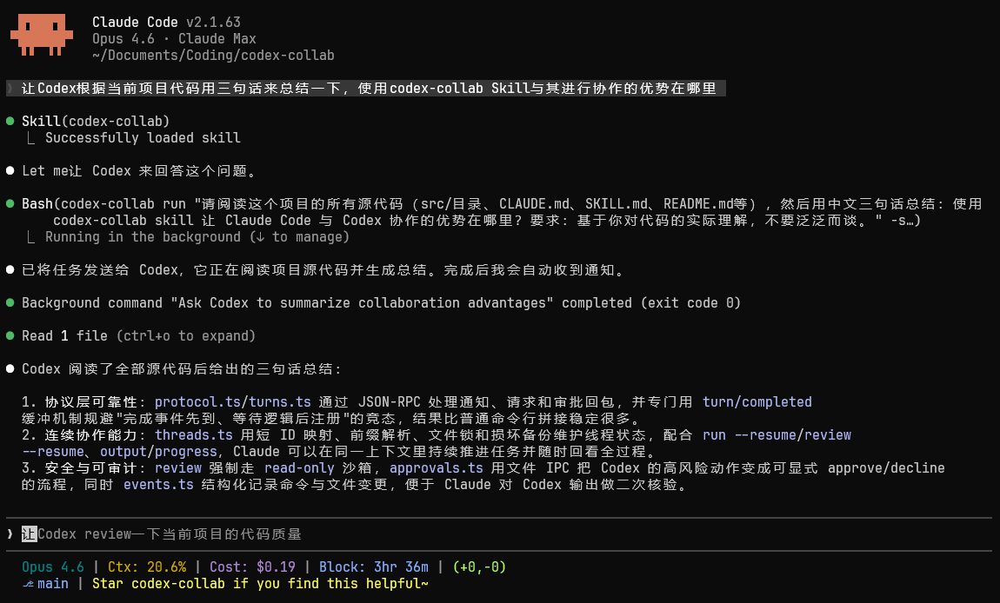

# codex-collab

[](https://github.com/Kevin7Qi/codex-collab/actions/workflows/ci.yml)
[](LICENSE)
[](https://bun.sh/)
[](https://www.typescriptlang.org/)

[English](README.md) | [中文](README.zh-CN.md)

在 [Claude Code](https://docs.anthropic.com/en/docs/claude-code) 中与 [Codex](https://github.com/openai/codex) 协作——派发任务、审查代码、并行研究，全程不用离开 Claude 会话。



codex-collab 是一个 [Claude Code 技能](https://docs.anthropic.com/en/docs/claude-code/skills)，借助 Codex app server 的 JSON-RPC 协议驱动 Codex——从会话的维护、结构化事件的实时推送，到工具调用的审批管控与对话恢复，全部在 Claude 会话内闭环完成。

## 核心优势

- **结构化通信** — 与 Codex 之间通过 stdio JSON-RPC 通信，每个事件都有完整的类型定义，可解析、可追踪。
- **实时进度反馈** — Codex 工作时实时推送进度，Claude 随时掌握运行状态。
- **一键代码审查** — 一条命令即可在只读沙箱中审查 PR、未提交更改或特定 commit。
- **会话复用** — 接续先前的会话继续对话，在既有上下文基础上推进，不必从头开始。
- **审批控制** — 按需配置工具调用的审批策略：自动批准、交互确认或拒绝。

## 环境要求

在 Linux (Ubuntu 22.04) 与 macOS 上测试通过。请确保以下工具已安装并加入 PATH：

- [Bun](https://bun.sh/) >= 1.0 — 用于运行 CLI
- [Codex CLI](https://github.com/openai/codex) — 须支持 `codex app-server` 子命令（已测试 0.106.0；`npm install -g @openai/codex`）

## 安装

```bash
git clone https://github.com/Kevin7Qi/codex-collab.git
cd codex-collab
./install.sh
```

运行后会自动构建独立 bundle 并部署到 `~/.claude/skills/codex-collab/`。完成后 Claude 即可自动发现该技能，无需额外配置。

开发模式（源码变更实时生效）：

```bash
./install.sh --dev
```

## 快速开始

```bash
# 向 Codex 提问
codex-collab run "这个项目是做什么的？" -s read-only --content-only

# 代码审查
codex-collab review --content-only

# 恢复会话继续对话
codex-collab run --resume <id> "现在检查错误处理" --content-only
```

## CLI 命令

| 命令 | 说明 |
|------|------|
| `run "prompt" [opts]` | 新建会话、发送提示、等待完成并输出结果 |
| `review [opts]` | 代码审查（PR、未提交更改、指定 commit） |
| `jobs [--json] [--all]` | 列出会话（`--limit <n>` 限制数量） |
| `kill <id>` | 中断运行中的会话 |
| `output <id>` | 查看会话完整日志 |
| `progress <id>` | 查看近期活动（日志尾部） |
| `models` | 列出可用模型 |
| `health` | 检查依赖项 |

<details>
<summary>会话管理</summary>

| 命令 | 说明 |
|------|------|
| `delete <id>` | 归档会话，删除本地文件 |
| `clean` | 清理过期日志和失效映射 |
| `approve <id>` | 批准待处理的请求 |
| `decline <id>` | 拒绝待处理的请求 |

</details>

<details>
<summary>选项</summary>

| 参数 | 说明 |
|------|------|
| `-d, --dir <path>` | 工作目录 |
| `-m, --model <model>` | 模型名称 |
| `-r, --reasoning <level>` | low, medium, high, xhigh（默认: xhigh） |
| `-s, --sandbox <mode>` | read-only, workspace-write, danger-full-access（默认: workspace-write；review 始终使用 read-only） |
| `--mode <mode>` | 审查模式: pr, uncommitted, commit, custom |
| `--ref <hash>` | 指定 commit 哈希（配合 `--mode commit`） |
| `--resume <id>` | 恢复已有会话 |
| `--approval <policy>` | 审批策略: never, on-request, on-failure, untrusted（默认: never） |
| `--content-only` | 隐藏进度输出；配合 `output` 时仅返回正文内容 |
| `--timeout <sec>` | 单轮超时时间，单位秒（默认: 1200） |
| `--base <branch>` | PR 审查的基准分支（默认: main） |

</details>

## 参与贡献

欢迎贡献！开发环境搭建及贡献流程详见 [CONTRIBUTING.md](CONTRIBUTING.md)。本项目遵循 [Contributor Covenant](CODE_OF_CONDUCT.md) 行为准则。

## 相关项目

如果只需更轻量的交互，不妨试试官方的 [Codex MCP server](https://developers.openai.com/codex/guides/agents-sdk)。codex-collab 则专为 Claude Code skill 场景打造，内置代码审查、会话管理与实时进度推送。
