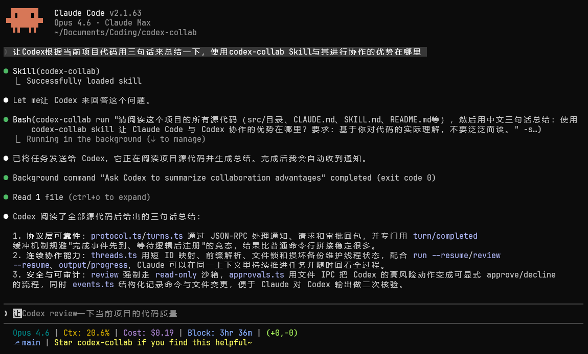

# codex-collab

[](https://github.com/Kevin7Qi/codex-collab/actions/workflows/ci.yml)
[](LICENSE)
[](https://bun.sh/)
[](https://www.typescriptlang.org/)

[English](README.md) | [中文](README.zh-CN.md)

在 [Claude Code](https://docs.anthropic.com/en/docs/claude-code) 中与 [Codex](https://github.com/openai/codex) 协作：派发任务、审查代码、并行研究，全程不用离开 Claude 会话。



codex-collab 是一个 [Claude Code 技能](https://docs.anthropic.com/en/docs/claude-code/skills)，借助 Codex app server 的 JSON-RPC 协议驱动 Codex：从会话的维护、结构化事件的实时推送，到工具调用的审批管控与对话恢复，全部在 Claude 会话内闭环完成。

## 核心优势

- **结构化通信**：与 Codex 之间通过 stdio JSON-RPC 通信，每个事件都有完整的类型定义，可解析、可追踪。
- **实时进度反馈**：Codex 工作时实时推送进度，Claude 随时掌握运行状态。
- **一键代码审查**：一条命令即可在只读沙箱中审查 PR、未提交更改或特定 commit。
- **会话复用**：接续先前的会话继续对话，在既有上下文基础上推进，不必从头开始。
- **审批控制**：按需为工具调用配置审批策略，可选自动批准、交互确认、拒绝，或交给 Codex 的 Guardian 自动审查（`--approval auto`）。
- **双向提问通道**：Codex 可在任务中途提问（`ask`），收到回答（`answer`）后继续执行；`next` 会持续等待，直到出现需要处理的事件。问题超时未获回答也不会阻塞任务，Codex 会自行判断并继续。
- **实时可观测**：`run --detach` 将长任务交给分离的运行进程；`follow --watch` 提供专门设计的实时视图，在终端分屏里持续跟踪每一次运行。
- **记忆隔离**：codex-collab 创建的会话默认不进入 Codex 的记忆功能，代理驱动的会话不会改变 Codex 对*你本人*工作方式的认知。可用 `--memory` 重新开启（详见选项说明）。

## 安装

需要 [Bun](https://bun.sh/) >= 1.0 和 [Codex CLI](https://github.com/openai/codex)（`npm install -g @openai/codex`）并加入 PATH。已在 Linux (Ubuntu 22.04)、macOS 与 Windows 10 上测试通过。

```bash
git clone https://github.com/Kevin7Qi/codex-collab.git
cd codex-collab
```

### Linux / macOS

```bash
./install.sh
```

### Windows

```powershell
powershell -ExecutionPolicy Bypass -File install.ps1
```

安装完成后，**重新打开终端**以使 PATH 生效，然后运行 `codex-collab health` 验证安装。

安装脚本会自动构建独立 bundle，部署到主目录下（Linux/macOS 为 `~/.claude/skills/codex-collab/`，Windows 为 `%USERPROFILE%\.claude\skills\codex-collab\`），并安装可执行文件（`install.ps1` 会将其加入 PATH；`install.sh` 会放置在 `~/.local/bin`，若该目录不在 PATH 中会打印提示）。完成后 Claude 即可自动发现该技能。

### 升级

升级已有安装时，拉取最新代码并重新运行安装脚本即可：

```bash
git pull
./install.sh
codex-collab health
```

Windows:

```powershell
git pull
powershell -ExecutionPolicy Bypass -File install.ps1
codex-collab health
```

安装脚本会替换已安装的 skill bundle 和可执行文件 shim。`~/.codex-collab/` 下已有的配置、模板、会话历史和运行日志都会保留。请将 `~/.claude/skills/codex-collab/` 视为安装脚本管理的目录：升级时其中的手动修改可能会被覆盖。

从旧版本升级时，codex-collab 会在首次使用时自动把会话状态迁移到按工作区划分的新布局，无需手动迁移状态。旧的 `jobs` 命令仍可作为 `threads` 的已弃用别名使用。

<details>
<summary>开发模式</summary>

使用 `--dev` 以符号链接方式安装，源码变更实时生效：

```bash
# Linux / macOS
./install.sh --dev

# Windows（可能需要启用开发者模式或使用管理员终端以创建符号链接）
powershell -ExecutionPolicy Bypass -File install.ps1 -Dev
```

</details>

## 快速开始

```bash
# 向 Codex 提问
codex-collab run "这个项目是做什么的？" -s read-only --content-only

# 代码审查
codex-collab review --content-only

# 恢复会话继续对话
codex-collab run --resume <id> "现在检查错误处理" --content-only

# 长任务：分离运行，在另一个终端分屏实时观看
codex-collab run "大规模重构" --detach --approval auto
codex-collab follow --watch
```

## CLI 命令

| 命令 | 说明 |
|------|------|
| `run "prompt" [opts]` | 新建会话、发送提示、等待完成并输出结果（`run -` 从标准输入读取提示词，不受 shell 引号转义困扰） |
| `review [opts]` | 代码审查（PR、未提交更改、指定 commit） |
| `threads [--json] [--all]` | 列出会话（`--limit <n>` 限制数量，`--discover` 扫描 app server，`--session` 只列当前会话期运行过的会话） |
| `kill <id> [--clear]` | 中断运行中的会话。若会话存在进行中的 goal，会先暂停再中断，否则 app server 会立即启动新一轮继续执行；`--clear` 表示直接放弃该 goal |
| `follow [id]` | 实时查看运行中的会话，结束时随其状态退出（已结束的会话则回放最近一次运行）。不带 ID 时自动附着到当前工作区的活跃运行；若无活跃运行，则回放最近一次。配合 `--watch` 保持打开并按启动顺序跟踪每一次新运行（每次运行只显示一次） |
| `output <id> [--last]` | 查看会话完整日志（`--last`: 只输出最近一轮的结果） |
| `progress <id>` | 查看近期活动（日志尾部） |
| `peek <id>` | 从 app server 查看最近的会话片段 |
| `ask "question"` | （供 Codex 在任务中途调用）向协作者提问并等待回答；`--timeout <sec>` 设置等待时限（默认 600 秒）。超时不视为失败：提示 Codex 自行判断并继续，随后以 0 退出 |
| `answer <id> "text"` | 回答待处理的问题（`answer <id> -` 从标准输入读取回答） |
| `questions [id]` | 列出当前工作区待处理的问题；带 ID 时显示该问题的完整内容 |
| `next` | 持续等待，直到出现需要处理的事件（问题或审批）；完整打印事件内容及响应方式后退出 |
| `config [key] [value]` | 查看或设置持久化默认值 |
| `models` | 列出可用模型 |
| `templates` | 列出可用提示词模板 |
| `health` | 检查依赖项 |
| `version` | 打印版本号（也可在命令前使用 `-v`/`--version`） |

<details>
<summary>会话管理</summary>

| 命令 | 说明 |
|------|------|
| `delete <id> [--purge]` | 归档会话（可用 `codex unarchive` 恢复）并删除本地文件；`--purge` 则在服务端永久删除，不可恢复 |
| `clean` | 清理过期日志和失效映射 |
| `approve <id>` | 批准待处理的请求 |
| `decline <id>` | 拒绝待处理的请求 |

</details>

<details>
<summary>选项</summary>

| 参数 | 说明 |
|------|------|
| `-d, --dir <path>` | 工作目录 |
| `-m, --model <model>` | 模型名称（默认: 自动选择最新可用模型） |
| `-r, --reasoning <level>` | none, minimal, low, medium, high, xhigh（默认: 自动选择模型支持的最高级别） |
| `-s, --sandbox <mode>` | read-only, workspace-write, danger-full-access（默认: workspace-write；review 始终使用 read-only） |
| `--mode <mode>` | 审查模式: pr, uncommitted, commit, custom |
| `--ref <hash>` | 指定 commit 哈希（配合 `--mode commit`） |
| `--resume <id>` | 恢复已有会话 |
| `--approval <policy>` | 审批策略: never, on-request, on-failure, untrusted, auto（默认: never）。`auto`: Codex 的 Guardian 审查器自主批准或拒绝每个请求，绝不阻塞等待人工；决策以 Guardian 进度行的形式实时展示 |
| `--memory` | 允许 Codex 的记忆功能学习本次运行创建的会话。默认: 创建的会话会执行 `thread/memoryMode/set mode=disabled`；恢复的会话永不改动（该标记按会话持久保存，你自己创建的会话应继续进入你的记忆）。只作用于 Codex 的*本地*记忆整合（`~/.codex/memories`）；`personality` 属于显式用户配置（非学习所得），不受影响。持久化设置: `config memory true` |
| `--detach` | （run）在轮次真正开始运行后立即返回；用 `follow <id>` 观看。任务的生命周期与发起它的 shell 解耦 |
| `-w, --watch` | （follow）运行结束后不退出，继续跟踪每一次新运行（Ctrl-C 停止） |
| `--template <name>` | 提示词模板（run 命令；优先使用 `~/.codex-collab/templates/`，然后使用内置模板） |
| `--goal <objective>` | （run）在第一轮开始前为会话创建 goal（配合 `--resume` 时替换已有目标）；需要在 `~/.codex/config.toml` 中设置 `goals = true`。配合 `--template collab` 时，目标末尾会附加一行 ask 通道说明；由于目标文本会在每个后续轮次重新注入，这条说明在整个 goal 期间始终有效 |
| `--budget <tokens>` | （run）`--goal` 的 token 预算。请预留充足余量：用量按每轮的完整上下文计算，即使很小的一轮也可能消耗约 6 万 token |
| `--json` | 对支持的命令输出 JSON（`threads`、`peek`） |
| `--all` | 列出全部会话，不限制显示数量 |
| `--discover` | 从 Codex app server 查询本地索引中没有的会话 |
| `--limit <n>` | 限制 `threads` 或 `peek` 显示的条目数 |
| `--full` | 在 `peek` 输出中包含所有条目类型（默认只显示消息） |
| `--content-only` | 隐藏进度输出；配合 `output` 时仅返回正文内容 |
| `--last` | （output）只输出最近一轮的结果，而非整个会话历史（隐含 `--content-only`） |
| `--session` | （threads）只列当前会话期运行过的会话 |
| `--timeout <sec>` | 单轮超时时间，单位秒（默认: 1200，最大 2147483）。存在进行中的 goal 时，该时限约束整个 goal，超时会先暂停 goal 再退出。用于 `ask` 时为回答等待时限（默认 600）；用于 `next` 时为等待上限（默认无限期等待） |
| `--base <branch>` | PR 审查的基准分支（默认: 自动检测默认分支） |
| `--` | 选项结束标记；其后的参数一律视为提示词文本 |
| `-` | （run）从标准输入读取提示词 |

`run` 和 `review` 的退出码标识运行结果：`0` 完成、`1` 失败、`3` 超时、`4` 被中断、`5` 因等待审批而中止（该审批请求已失效，请用更长的 `--timeout` 恢复，或改用 `--approval auto`）、`6` broker 占用（瞬态，可重试）、`7` goal 因受阻或用量/预算达到上限而结束，需要人工介入（用 `--resume` 恢复会话并给出指引，或用 `kill --clear` 放弃该 goal）。

**Goal 模式**：Codex 的 Goal 模式（在 `~/.codex/config.toml` 中设置 `goals = true`）让会话自动持续推进：只要 goal 尚未结束，每轮完成后 app server 会立即启动下一轮。goal 可由 Codex 在任务中途自行创建，也可以用 `run --goal "objective" [--budget <tokens>]` 显式设置，适合无法预估轮数的开放式目标。目标文本会在每个后续轮次重新注入；内容较复杂的目标，可以改为指向仓库中的规格或计划文档。当会话存在（或中途出现）进行中的 goal 时，`run` 会在同一份运行记录和日志中跟踪每个后续轮次，直到 goal 结束：一次运行对应一个完整的工作单元，而不只是第一轮。此时 `--timeout` 约束整个 goal，超时会先**暂停** goal（可随时恢复，不会在无人值守的情况下持续消耗 token），再以 `3` 退出。`threads` 会显示每个会话最新的 goal 状态（`[goal active: 45k/100k tokens]`）。

`next` 的退出码：`0` 收到事件（内容完整打印到标准输出）、`3` `--timeout` 时限内没有事件、`10` 工作区空闲（没有运行中的任务，也没有待处理的事件）。

</details>

## 默认值与配置

默认情况下，codex-collab 自动选择**最新模型**（优先选择 `-codex` 变体）及该模型支持的**最高推理级别**。无需配置，新模型发布后自动更新。

使用 `codex-collab config` 持久化覆盖默认值：

```bash
codex-collab config                     # 查看当前配置
codex-collab config model gpt-5.3-codex # 设置默认模型
codex-collab config reasoning high      # 设置默认推理级别
codex-collab config model --unset       # 取消单个设置（恢复自动检测）
codex-collab config --unset             # 取消所有设置
```

可配置项: `model`、`reasoning`、`sandbox`、`approval`、`timeout`、`memory`

优先级: `CLI 参数 > 配置文件 > 自动检测`

配置存储于 `~/.codex-collab/config.json`。

## 参与贡献

欢迎贡献！开发环境搭建及贡献流程详见 [CONTRIBUTING.md](CONTRIBUTING.md)。本项目遵循 [Contributor Covenant](CODE_OF_CONDUCT.md) 行为准则。

## 相关项目

如果只需更轻量的交互，不妨试试官方的 [Codex MCP server](https://developers.openai.com/codex/guides/agents-sdk)。codex-collab 则专为 Claude Code skill 场景打造，内置代码审查、会话管理与实时进度推送。
